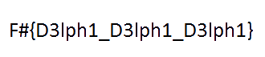

# Unlockme

## Writeup
In this challenge we are given a PE executable which uses Delphi template. Our input is of size 25 characters.

These are steps that I took while solving the challenge:

* Finding out that our input is repeatedly xored with a buffer.

* After xoring the resultant buffer is loaded as a PNG file(therefore we need to give our input such that after xoring with the encrypted buffer it forms a valid PNG file).

* Writing all the possible inputs

* checking if the possible inputs forms a valid PNG file

Only 1 input actually forms a valid PNG file

FLAG : **F#{D3lph1_D3lph1_D3lph1}**

link to bruteforce script(Around 4000 PNG images will be created) : [link](script.py)
